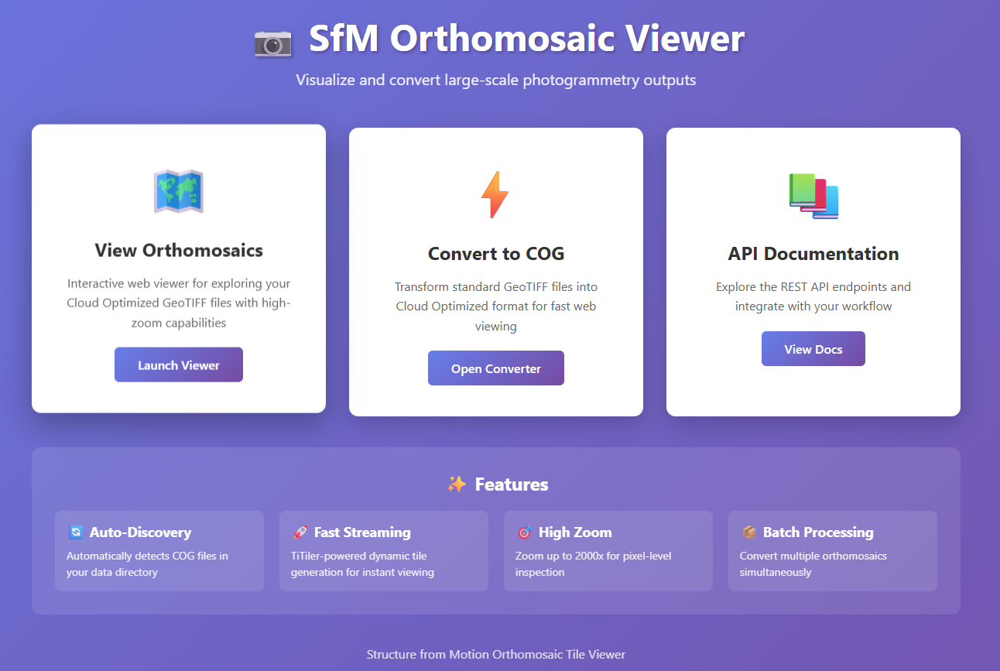
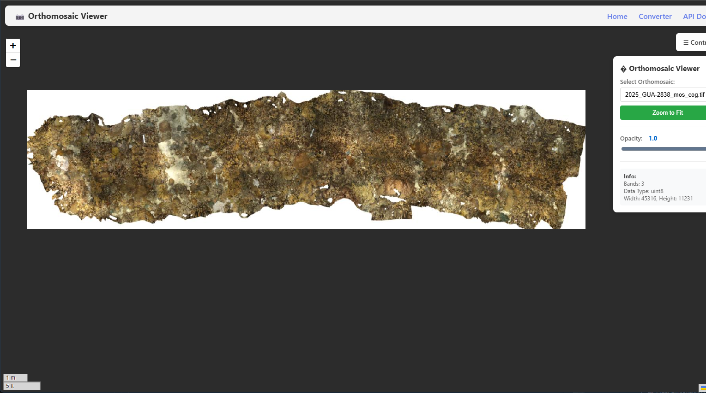
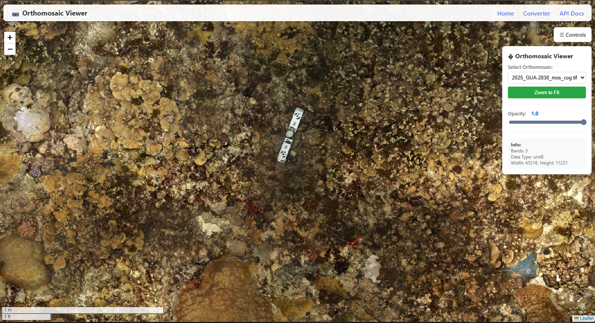
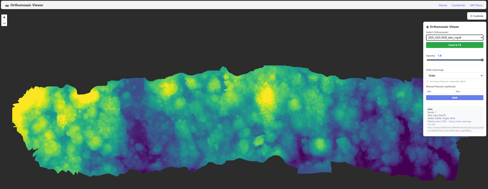
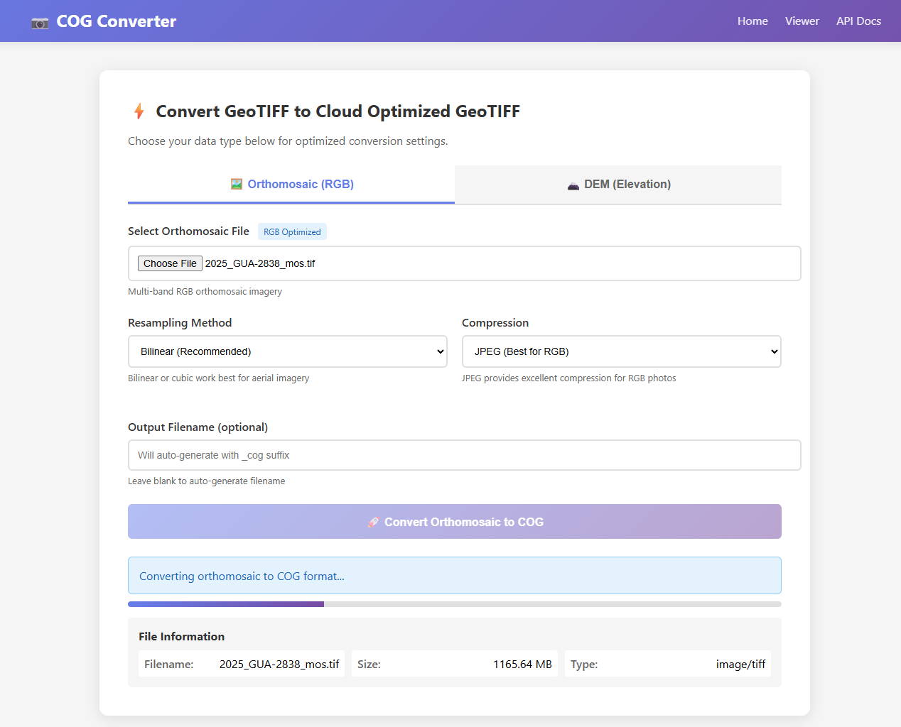

# SfM Orthomosaic Tile Viewer

A lightweight web-based viewer for visualizing large Structure from Motion (SfM) orthomosaics using Cloud Optimized GeoTIFFs (COG), TiTiler, and Leaflet.



## Features
- **Orthomosaic Viewer**: Clean web interface optimized for viewing photogrammetry outputs
- **Auto-Discovery**: Automatically detects and lists COG files in the data directory
- **COG Conversion**: Convert standard GeoTIFFs to COG format (single or batch)
- **Fast Tile Server**: TiTiler-based FastAPI server with dynamic tile generation
```
Traditional GeoTIFF               Cloud Optimized GeoTIFF
─────────────────                ─────────────────────────
                                 
┌─────────────────┐              ┌───┬───┬───┬────┐
│                 │              │ T │ I │ L │ E  │
│   Must Download │              ├───┼───┼───┼────┤
│   Entire File   │              │ S │   │   │    │
│   (500 MB)      │              ├───┼───┼───┼────┤
│                 │              │ + │Overviews   │
│                 │              ├───┴───┴───┴────┤
└─────────────────┘              │Stream on Demand│
                                 └────────────────┘
     ❌ Slow                           ✅ Fast
```

## Ortho Viewer



## DEM Viewer


## Ortho/DEM GeoTiff to COG Web Convter


## Quick Start

### Using Docker 
- https://hub.docker.com/repository/docker/michaelakridge326/sfm-tile-ortho-viewer

```bash
# Clone repository
git clone https://github.com/MichaelAkridge-NOAA/sfm-orthomosaic-tile-viewer.git
cd sfm-orthomosaic-tile-viewer

# Place your COG files in the data/ directory
# (or convert them - see conversion steps below)

# Start with Docker Compose
docker-compose up -d

# Open browser to http://localhost:8000
```

### Using Local Python

```bash
# Clone and install
git clone https://github.com/MichaelAkridge-NOAA/sfm-orthomosaic-tile-viewer.git
cd sfm-orthomosaic-tile-viewer
pip install -r requirements.txt

# Optional | Convert your orthomosaic to COG format before starting server
#python make_cog.py --src "your_ortho.tif" --dst "data/your_ortho_cog.tif"

# Start the server
uvicorn main:app --reload

# Open browser to http://localhost:8000
```

## Project Structure

```
├── main.py                          # FastAPI server
├── config.yaml                      # Configuration
├── requirements.txt                 # Python dependencies
├── web/                             # Web interface
│   ├── index.html                   # Landing page
│   ├── viewer.html                  # Orthomosaic/DEM viewer
│   └── converter.html               # COG converter interface
├── scripts/                         # Utility scripts
│   ├── make_cog.py                  # Single file COG converter
│   ├── make_cog_batch.py            # Batch COG converter
│   ├── start.sh                     # Linux/Mac startup
│   └── start.bat                    # Windows startup
├── data/                            # COG files directory
├── Dockerfile                       # Docker image
└── docker-compose.yml               # Docker Compose setup
```

## Workflow
```
┌─────────────────┐
│  GeoTIFF File   │
│   (Original)    │
└────────┬────────┘
         │
         ▼
┌─────────────────┐
│   make_cog.py   │
│  (Conversion)   │
└────────┬────────┘
         │
         ▼
┌─────────────────┐
│  COG File       │
│  ├─ Tiles       │
│  ├─ Overviews   │
│  └─ Metadata    │
└────────┬────────┘
         │
         ▼
┌─────────────────┐
│  TiTiler Server │
│  (FastAPI)      │
└────────┬────────┘
         │
         ▼
┌─────────────────┐
│  Leaflet Map    │
│  (Web Viewer)   │
└─────────────────┘
```
### Step 1: Convert Orthomosaics to COG Format (or Use Web App)

Transform your SfM-generated orthomosaics into Cloud Optimized GeoTIFFs for efficient web viewing.

#### Single Orthomosaic

```bash
python scripts/make_cog.py --src "ortho_2025.tif" --dst "data/ortho_2025_cog.tif" --resampling bilinear
```

**Common Options:**
- `--resampling` - Overview resampling method (default: `bilinear`)
  - `bilinear` - Best for orthomosaics (smooth)
  - `cubic` - Higher quality, slower
  - `nearest` - Fastest, preserves exact pixel values
- `--profile` - Compression (auto-detected: JPEG for RGB, LZW for others)
  - `jpeg` - Best for RGB orthomosaics (smaller files)
  - `lzw` - Lossless compression
  - `zstd` - Modern compression, smaller files

#### Batch Processing

Process multiple orthomosaics from a survey campaign:

```bash
# Convert all orthomosaics in a directory
python scripts/make_cog_batch.py --src-dir "./orthomosaics" --dst-dir "./data"

# Process specific sites with pattern matching
python scripts/make_cog_batch.py --src-dir "./surveys" --dst-dir "./data" --pattern "*_ortho.tif" --resampling cubic

# Handle subdirectories (organized by date/site)
python scripts/make_cog_batch.py --src-dir "./surveys" --dst-dir "./data" --recursive --overwrite
```

**Batch Options:**
- `--pattern` - Filter files (e.g., `"*_ortho.tif"`, `"site_*.tif"`)
- `--suffix` - Output suffix (default: `_cog`)
- `--recursive` - Process subdirectories
- `--overwrite` - Replace existing COG files

**💡 Tip:** For RGB orthomosaics, JPEG compression (auto-selected) provides 50-70% file size reduction with minimal quality loss.

### 2. Start the Tile Server

```bash
# Start server (default: http://localhost:8000)
uvicorn main:app --reload

# Custom port
uvicorn main:app --reload --port 8080
```

The server hosts both the tile API and the map viewer.

**Available URLs:**
- `http://localhost:8000/` - Interactive orthomosaic viewer
- `http://localhost:8000/docs` - Interactive API documentation
- `http://localhost:8000/api/cog-files` - List available COG files
- `http://localhost:8000/tiles/{z}/{x}/{y}.png?url={path}` - Tile service
- `http://localhost:8000/bounds?url={path}` - Raster bounds
- `http://localhost:8000/info?url={path}` - Raster metadata
- `http://localhost:8000/static/*` - Static files from data directory

### 3. Use the Orthomosaic Viewer

Navigate to `http://localhost:8000/` in your browser. The viewer will automatically:
- Scan the `data/` directory for COG files (files containing "cog" in the name)
- Populate a dropdown selector with available orthomosaics
- Load and zoom to the first available orthomosaic

**Viewer Features:**
- Clean, focused interface for orthomosaic viewing
- Dropdown selector for multiple orthomosaics
- Opacity slider for transparency control
- Raster metadata display (bands, data type, dimensions)
- Dynamic loading without page refresh
- Scale bar (metric/imperial) and zoom-to-fit controls
- Max zoom level of 2000 for detailed inspection
- Dark background for better image contrast

**Adding More Orthomosaics:**
Simply place COG files in the `data/` directory with "cog" in the filename (e.g., `my_ortho_cog.tif`). They will automatically appear in the dropdown selector.

## Configuration

All settings are managed via `config.yaml`:

```yaml
# Server settings
server:
  host: "0.0.0.0"
  port: 8000
  reload: true

# Data directory
data:
  directory: "data"           # Where COG files are stored
  pattern: "*cog*.tif"        # Pattern to match COG files
  include_extensions:
    - ".tif"
    - ".tiff"

# CORS settings (for production)
cors:
  enabled: true
  origins:
    - "*"  # Change to specific domains in production
```

### Common Configuration Changes

**Custom data directory:**
```yaml
data:
  directory: "/mnt/orthomosaics"  # Your custom path
```

**Production CORS:**
```yaml
cors:
  origins:
    - "https://yourdomain.com"
    - "https://www.yourdomain.com"
```

**Custom port:**
```yaml
server:
  port: 8080
```

## Docker Deployment

### Basic Usage

```bash
# Build and start
docker-compose up -d

# View logs
docker-compose logs -f

# Stop
docker-compose down
```

### Custom Data Directory

Edit `docker-compose.yml` to mount your orthomosaic directory:

```yaml
volumes:
  - /path/to/your/orthomosaics:/app/data
```

### Production Deployment

```bash
# Pull from Docker Hub
docker pull michaelakridge326/sfm-tile-ortho-viewer:latest

# Run with custom settings
docker run -d \
  -p 8000:8000 \
  -v /path/to/data:/app/data \
  -v /path/to/config.yaml:/app/config.yaml \
  --name ortho-viewer \
  michaelakridge326/sfm-tile-ortho-viewer:latest

# Or build locally
docker build -t sfm-ortho-viewer:latest .
docker run -d -p 8000:8000 -v ./data:/app/data sfm-ortho-viewer:latest
```

## Technical Details

### Why Cloud Optimized GeoTIFF (COG)?

Standard GeoTIFFs require downloading the entire file before viewing. COG format enables:
- **Streaming**: View imagery immediately via HTTP range requests
- **Pyramids**: Multi-resolution overviews for fast zoom levels
- **Tiling**: Internal 256x256 tiles for efficient random access
- **Bandwidth**: Only download visible area, not entire file

### TiTiler Server

[TiTiler](https://github.com/developmentseed/titiler) provides dynamic tile generation:
- Renders tiles on-the-fly from COG files
- No pre-processing or tile cache needed
- Supports any coordinate system (automatic reprojection)
- Built on FastAPI for speed and async support

### Supported Formats

- **Input**: GeoTIFF (single/multi-band), any CRS
- **Output**: Web Mercator tiles (PNG/JPEG)
- **Data Types**: uint8, uint16, int16, uint32, int32, float32, float64
- **Recommended**: RGB orthomosaics (3-band, uint8)


## Quick Reference

### Command Cheat Sheet

```bash
# Local Development
./scripts/start.sh                   # Linux/Mac startup
scripts\start.bat                    # Windows startup
uvicorn main:app --reload            # Manual start

# Docker
docker-compose up -d                 # Start in background
docker-compose logs -f               # View logs
docker-compose down                  # Stop
docker-compose restart               # Restart

# COG Conversion
python scripts/make_cog.py --src INPUT --dst OUTPUT
python scripts/make_cog_batch.py --src-dir DIR --dst-dir OUTPUT
```


### Download Sample Data (Optional)

Try the viewer with sample COG files from NOAA:

**Browse all available files:**
- Web: https://console.cloud.google.com/storage/browser/nmfs_odp_pifsc/PIFSC/ESD/ARP/StRS_Sites_Products/orthomosaic_cog
- CLI: `gsutil ls gs://nmfs_odp_pifsc/PIFSC/ESD/ARP/StRS_Sites_Products/orthomosaic_cog/`

**Using wget (Alternative):**
```bash
# Download orthomosaic
wget -P data/ https://storage.googleapis.com/nmfs_odp_pifsc/PIFSC/ESD/ARP/StRS_Sites_Products/orthomosaic_cog/2025_GUA-2838_mos_cog.tif

# Download bathymetric DEM
wget -P data/ https://storage.googleapis.com/nmfs_odp_pifsc/PIFSC/ESD/ARP/StRS_Sites_Products/orthomosaic_cog/2025_GUA-2838_dem_cog.tif
```

**Using curl (Alternative):**
```bash
# Download orthomosaic
curl -o data/2025_GUA-2838_mos_cog.tif https://storage.googleapis.com/nmfs_odp_pifsc/PIFSC/ESD/ARP/StRS_Sites_Products/orthomosaic_cog/2025_GUA-2838_mos_cog.tif

# Download bathymetric DEM
curl -o data/2025_GUA-2838_dem_cog.tif https://storage.googleapis.com/nmfs_odp_pifsc/PIFSC/ESD/ARP/StRS_Sites_Products/orthomosaic_cog/2025_GUA-2838_dem_cog.tif
```

**Using gsutil (Google Cloud SDK):**
```bash
# Install gsutil if needed: https://cloud.google.com/storage/docs/gsutil_install

# Download orthomosaic (~350MB)
gsutil cp gs://nmfs_odp_pifsc/PIFSC/ESD/ARP/StRS_Sites_Products/orthomosaic_cog/2025_GUA-2838_mos_cog.tif data/

# Download bathymetric DEM (~80MB)
gsutil cp gs://nmfs_odp_pifsc/PIFSC/ESD/ARP/StRS_Sites_Products/orthomosaic_cog/2025_GUA-2838_dem_cog.tif data/
```

----------

#### Disclaimer
This repository is a scientific product and is not official communication of the National Oceanic and Atmospheric Administration, or the United States Department of Commerce. All NOAA GitHub project content is provided on an ‘as is’ basis and the user assumes responsibility for its use. Any claims against the Department of Commerce or Department of Commerce bureaus stemming from the use of this GitHub project will be governed by all applicable Federal law. Any reference to specific commercial products, processes, or services by service mark, trademark, manufacturer, or otherwise, does not constitute or imply their endorsement, recommendation or favoring by the Department of Commerce. The Department of Commerce seal and logo, or the seal and logo of a DOC bureau, shall not be used in any manner to imply endorsement of any commercial product or activity by DOC or the United States Government.

#### License
This repository's code is available under the terms specified in [LICENSE.md](./LICENSE.md).

## Acknowledgments

This project uses [TiTiler](https://github.com/developmentseed/titiler) by Development Seed for dynamic tile generation. TiTiler is licensed under the [MIT License](https://github.com/developmentseed/titiler/blob/main/LICENSE).
